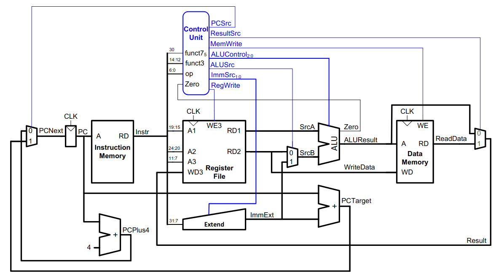
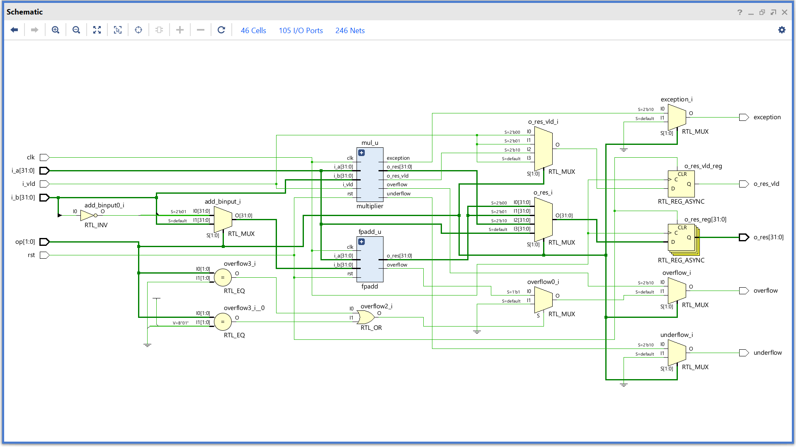
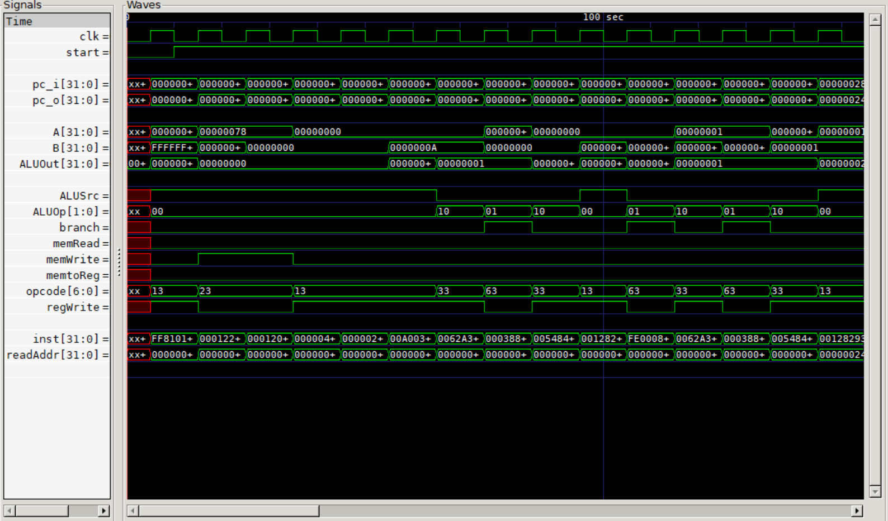
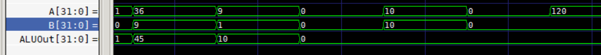

# 32-bit RISC-V Processor (Single Cycle) 

## Title
Design and Implementation of a 32-bit RISC-V Single-Cycle Processor with Custom ALU and Assembler

---

## 1. Introduction

This project involves the construction of a 32-bit RISC-V processor implemented in Verilog.  
The current progress covers two major components:

- A standalone **ALU design** with a 100-bit adder using Carry Look-Ahead logic
- A complete **Single-Cycle CPU** implementing the RISC-V RV32I instruction set, with a floating-point datapath extension and a custom Python-based assembler

---

## 2. Architecture Overview

### 2.1 ALU Design
A standalone ALU was first designed and verified independently. It includes:
- 100-bit carry look-ahead adder (`cla.v`)
- Full ALU supporting arithmetic and logical operations (`alu.v`)
- Testbench for functional verification (`testbench.v`)

### 2.2 Single-Cycle CPU Architecture
A complete single-cycle RISC-V datapath including:
- ALU and ALU Control
- Register File
- Immediate Generator
- Instruction and Data Memory
- Control Unit
- Floating-Point datapath extension
- PC and Adder logic


*Single-Cycle Processor Architecture*


*RTL of Floating Point Unit*

---

## 3. Performance Analysis

### 3.1 Single-Cycle Execution
- Each instruction completes in exactly **1 clock cycle**
- Total cycles: `Cycles = N`
- Execution time: `T = N × T_clk`
- Clock period is constrained by the slowest instruction path

---

## 4. Verification

### 4.1 Assembly Test Program
```
_start:
    addi sp, sp, -8       # reserve 8 bytes on stack
    sw   x0, 4(sp)        # store 0 at (sp+4)
    sw   x0, 0(sp)        # store 0 at (sp)

    addi s1, x0, 0        # s1 = sum = 0
    addi t0, x0, 0        # t0 = counter = 0
    addi t1, x0, 10       # t1 = limit = 10
LOOP:
    slt  t2, t0, t1       # t2 = (t0 < 10)
    beq  t2, x0, END      # if not less, jump to END
    add  s1, s1, t0       # s1 += t0
    addi t0, t0, 1        # t0++
    beq  x0, x0, LOOP     # unconditional jump
END:
    sw   s1, 0(sp)        # store result (sum=45)
    lw   s0, 0(sp)        # load back sum into s0
    addi sp, sp, 8        # release stack
    beq  x0, x0, END      # hang here
```

### 4.2 Assembler Output (Hex)
```
0x00: FF 81 01 13
0x04: 00 01 22 23
0x08: 00 01 20 23
0x0C: 00 00 04 93
0x10: 00 00 02 93
0x14: 00 A0 03 13
0x18: 00 62 A3 B3
0x1C: 00 03 88 63
0x20: 00 54 84 B3
0x24: 00 12 82 93
0x28: FE 00 08 E3
0x2C: 00 91 20 23
0x30: 00 01 24 03
0x34: 00 81 01 13
0x38: FE 00 0A E3
```

### 4.3 GTKWave Simulation Output


*Control signals — first ten instructions*


*ALU output waveform*

---

## 5. Conclusion

Progress so far demonstrates:
- Functional standalone ALU with carry look-ahead logic
- Complete single-cycle RISC-V datapath in Verilog
- Floating-point unit integration
- Custom assembler generating machine code from RISC-V assembly
- Full simulation and waveform verification

---

## Credits

Project Contributors:

Anshuman Dave

Nishant AS
